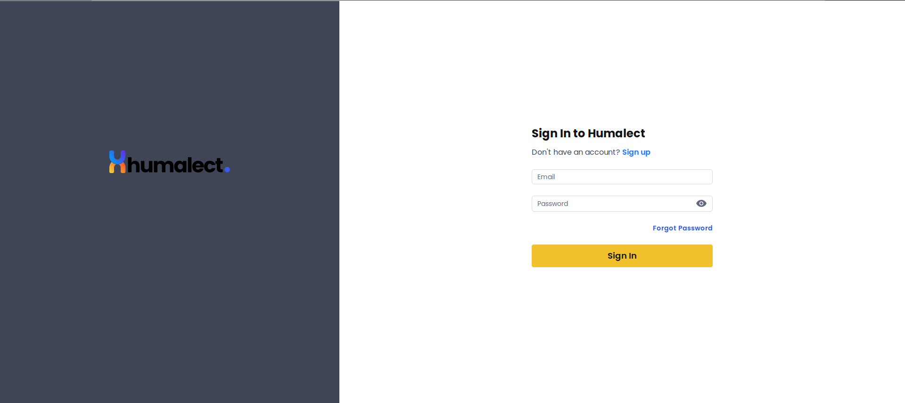
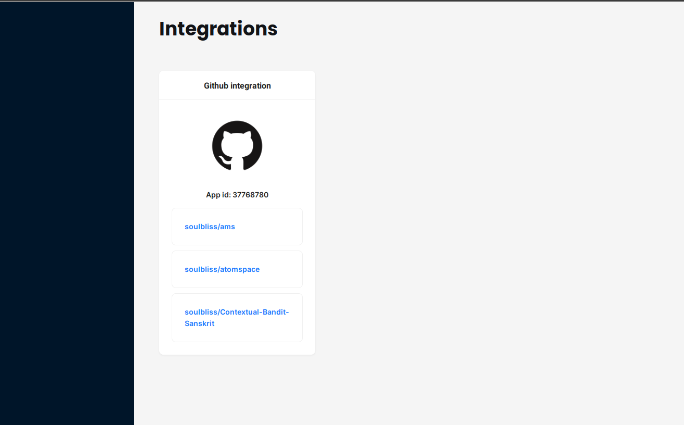

# About

Implementaion of assignment for github API integration using MERN (stack).



The web interface




The Github integration

[]

## Project contains

1. Mongo DB, React, Express and JavaScript used (MERN) stack
2. JWT based authentication using Passport JS, persisting the sessions in mongoDB
3. Fully functional User registration, Email verification flow, login and logout.
4. Github OAuth flow, Github webhooks based functionality, persists to store.


# Installation

Before running the further steps, make sure you have a local mongo instance running.


1. If you don't have mongo running, use docker compose to start a local mongo instance

2. In the root of the directory run `docker-compose up -d`

3. Go to `client` directory, run `npm run start`

4. Go to `server` directory

   1. Update the environment variables by creating `.env `  file.

      1. `cp sample.env .env`

      2. ```
         PORT=5000
         APP_HOST=http://localhost:3000
         DB_URL=mongodb://localhost:27017/wisdom
         SENDBLUE_API_KEY=
         EMAIL_SWITCH=ON
         ```
      3. Update the values (send in blue API is necessary for the email verification flow)

   2. Run `nodemon ./bin/www  `
   
   3. Enjoy!


### Things kept in mind
1. Code style, quality, modularity, coherent commits, and clean commit messages
2. Attention to detail
3. Matching the design accuracy